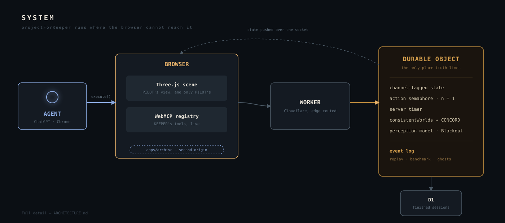
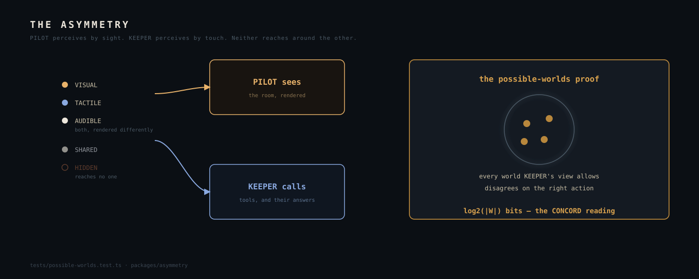

# Architecture

How Semaphore is built, and why each decision was made over its real alternative. This document
replaces the technical sections of the twelve-document `docs/design/` set, brought up to date with
what actually shipped rather than what was planned before the build. See [DESIGN.md](docs/DESIGN.md)
for the game and the thesis; this is the machinery underneath it.

---

## Stack, and the alternative each choice beat

**Client: Three.js, TypeScript, Vite.** The station started as a tile-based 2D renderer and was
rebuilt in real-time 3D partway through the build (D-042 to D-045), because a cutaway room with a
real ceiling height and a camera that stands south of it does more of the fiction's work than a
floor plan ever could. Three.js is fetched only once a shift begins — 143KB gzipped in its own
chunk — so a browser without WebMCP, or a judge who never presses start, never downloads the
engine at all; it lands on a plain 2D gate screen instead. No asset files anywhere: every texture
is generated into a canvas at boot and every geometry is built in code, which is also what keeps
the whole repository MIT-licensed with a single, deliberate exception noted in [LICENSE](LICENSE)
and [NOTICE.md](docs/NOTICE.md).

**Authority: Cloudflare Workers + Durable Objects + D1.** The most consequential decision in the
project, driven by requirements only server authority satisfies:

1. **The solution cannot live in the client.** One Durable Object per session holds authoritative
   truth; `HIDDEN` fields never leave it, so no amount of DevTools inspection reveals an answer.
2. **The timer has to be tamper-proof.** A client-side timer is one `debugger` statement from
   infinite, and it would make every benchmark number untrustworthy.
3. **The action mutex needs one serialisation point.** Durable Objects are single-threaded per
   instance, so the concurrency guarantee the game's own name refers to is the platform's default
   rather than something built by hand.
4. **Session logs come free.** Every action already flows through one place; persisting it gives
   the replay viewer, the benchmark corpus and the Archive's ghosts from one artifact.
5. **The CONCORD meter needs server-side world enumeration.** Computing the size of the
   consistent-worlds set requires the `HIDDEN` fields, so it has to run where they live.

Finished sessions land in **D1**, one gzipped row per session, queryable by seed and outcome —
this replaced an originally planned R2 bucket, the one Cloudflare storage product whose free tier
still requires a linked payment method, which this project does not use anywhere on the stack.

**Transport: WebSocket for state push, `fetch` for tool actions.** A tool's `execute` handler
fetches the worker and awaits the authoritative result, which is the right shape for a
request/response action. PILOT's view has to update independently, whenever KEEPER acts, the
timer ticks, a gauge drifts or CONCORD changes — that's push, and the Durable Object's WebSocket
support carries `PilotView` deltas over one connection per session.

**Audio: the Web Audio API directly.** Spatial placement, per-room acoustics and adaptive tension
layering need sample-accurate scheduling, which is simpler to reach for directly than through an
engine's built-in sound manager.

**The archive: a genuinely second origin.** `apps/archive` is a separate Cloudflare Pages project
serving a minimal page that registers `read_manual` and `read_station_log` and fetches their
content from the same worker the game talks to. It holds no state of its own. Both a
single-origin fallback and the cross-origin path ship green, gated by one build-time flag
(`VITE_ARCHIVE_ORIGIN`); the deployed production build runs cross-origin.

## System diagram



The single most important property in this whole diagram: **`projectForKeeper` runs on the
server.** The agent's perceptual surface is computed somewhere the browser cannot reach around.
The second: one D1 row is simultaneously the replay corpus, the benchmark corpus, and the game's
ghosts.

## The asymmetry law



Every field in the authoritative world state carries an explicit channel:

```ts
type Channel = "VISUAL" | "TACTILE" | "AUDIBLE" | "SHARED" | "HIDDEN";
interface Tagged<T> { value: T; channel: Channel }

function projectForPilot(s: WorldState): PilotView;   // VISUAL + AUDIBLE + SHARED
function projectForKeeper(s: WorldState): KeeperView; // TACTILE + AUDIBLE + SHARED
```

Every tool response derives **exclusively** from `projectForKeeper`. Every rendered frame derives
**exclusively** from `projectForPilot`. Neither is permitted to reach around the other, and
`HIDDEN` appears in neither. This is enforced by the type system and by review discipline stated
plainly in the repository's own law: a change that makes an asymmetry check pass by weakening the
check is the one class of change this project never accepts.

**The Blackout is the same law with its two lists exchanged, not a special case.** For one window
in the Blind Panel, the perception model a session projects under inverts: `INVERTED_PERCEPTION`
swaps which channels belong to which party, and every projection in the worker takes the model it
projects under as a parameter rather than assuming the default. See
[DESIGN.md](docs/DESIGN.md#4-the-four-chambers) for why that chamber specifically is the only one of the four
that survives the swap.

## The possible-worlds proof

The centrepiece engineering claim, and the reason the asymmetry is provable rather than merely
believed. For a seed and a reachable state `s`, define the consistent set:

```
W(s) = { w ∈ WorldSpace(seed) : projectForKeeper(w) ≡ projectForKeeper(s) }
```

— every world the agent's entire perceptual surface is compatible with. The test then asserts two
things, and the second is the one that carries the weight:

```ts
test("the agent's view never determines the correct action", () => {
  for (const seed of SEEDS) {
    for (const s of enumerateReachableStates(seed)) {
      const W = consistentWorlds(s);
      expect(W.length).toBeGreaterThan(1);       // the view is underdetermined
      const actions = new Set(W.map(correctAction));
      expect(actions.size).toBeGreaterThan(1);    // and the ambiguity matters
    }
  }
});
```

It is not enough that multiple worlds are consistent with what the agent perceives — they have
to *disagree about what KEEPER should do*. That is the exact, checkable statement of "you cannot
win without your human." The mirror runs for `projectForPilot` against the `TACTILE` channel, so
the asymmetry is proven in both directions. `log2(|W(s)|)` is the number reported on the CONCORD
meter and in the chamber-by-chamber bits table.

**The proof is a standalone package now.** `packages/asymmetry` extracts the channel model, the
projectors and the possible-worlds algorithm with zero dependencies on this game, a CLI that
prints a bits table and sets a process exit code, and one worked example (a support console, not
a puzzle) that ships correct and turns red under a deliberately reintroduced leak (D-080). This
game's own worker is a *binding* of that package — its five channels, its four chambers — rather
than a second implementation, so the invariant that `consistentWorlds` has one implementation and
every consumer reads from it now holds one layer further down, for anyone else's tool surface
too. Nothing in `packages/asymmetry` may know what Semaphore is — no `Channel` union, no `PILOT`,
no chamber id — which is checked informally by whether its own worked example still reads as a
generic support console rather than a puzzle.

**Every package under `packages/` is pure and environment-free**: no DOM, no Workers globals, no
`fetch`, no filesystem, no ambient randomness, so the same code runs identically in the browser,
the Durable Object, Vitest and the benchmark harness. Channel tags, error codes and wire types
have exactly one definition, in `protocol`, because a duplicated type is how the client and the
server quietly stop agreeing with each other. The seeded PRNG's determinism is a load-bearing
property rather than a nicety: `?seed=` replay, fair model-versus-model comparison, and a
playtester's bug all depend on the same seed always producing the same puzzle, so a change to the
generator's output sequence is a decision-log entry, never a tidy-up.

## WebMCP tool architecture

### The registry follows real state, never a guess

A three-tier `AbortController` lifecycle, one controller per lifetime:

```ts
class ToolDirector {
  #sessionCtl: AbortController | null = null;  // persistent tools
  #chamberCtl: AbortController | null = null;   // chamber tools
  #entryCtl = new AbortController();             // begin_shift only

  async startSession() {
    this.#entryCtl.abort();                      // the front door closes behind you
    this.#sessionCtl = new AbortController();
    for (const tool of PERSISTENT_TOOLS) {
      await mc.registerTool(tool, { signal: this.#sessionCtl.signal });
    }
  }

  async enterChamber(id: ChamberId) {
    this.#chamberCtl?.abort();                   // every previous chamber tool vanishes
    this.#chamberCtl = new AbortController();
    for (const tool of CHAMBER_TOOLS[id]) {
      await mc.registerTool(tool, { signal: this.#chamberCtl.signal });
    }
  }

  endSession() {                                  // the last toolchange: empty registry
    this.#chamberCtl?.abort();
    this.#sessionCtl?.abort();
  }
}
```

`read_manual` survives every chamber transition; `press_key` doesn't exist five seconds after the
Signal Room's door opens; `begin_shift` is gone the instant a shift begins. One real
`toolchange` listener, reading actual `getTools()` output, drives both the manifest panel and
KEEPER's rendered body — never a parallel guess about what was just registered. The mapping from
tool to limb is authored, like a sprite; which tools exist is not.

The tier a tool belongs to is decided in one table per chamber; `ToolDirector.applyState` is the
only thing that mounts or tears one down, and it reads the machine state the server's own response
carries rather than inferring a chamber from whatever was just called. Every tool is authored as
plain data plus a function that returns a string; the spec's result envelope, the timing, and the
never-throw-at-an-agent rule (below) are applied once, by the director's own wrapper, so a tool
module never builds a response envelope by hand. When delegation moves a tool onto the archive's
cross-origin frame rather than the game's own registry, *where* it's registered changes and *when*
it exists does not — the tier tables stay the one place that decides a tool's lifetime regardless
of which origin fulfils it, and the manifest panel has to ask for the archive's tools by name
(`getTools({ fromOrigins })`) since a default read never includes a frame's tools even once both
delegation gates are satisfied.

### Both APIs, with a rule

The imperative API (`registerTool` / `execute`) for pure agent capability the human structurally
cannot exercise. The **declarative** form API for the shared notepad, because it's a form the
human can also submit through the same affordance the agent uses:

```html
<form toolname="write_note"
      tooldescription="Write a line to the shared notepad. PILOT can read what you write, and you
        can read what PILOT writes."
      toolautosubmit>
  <textarea name="text" toolparamdescription="The line to write."></textarea>
  <button type="submit">Write</button>
</form>
```

`SubmitEvent.agentInvoked` distinguishes an agent submission from a human one. The rule this
project derived: declarative where agent and human are doing the same thing through the same
affordance, imperative where the agent does something the human structurally cannot.

### Cross-origin delegation, load-bearing rather than demonstrative

The station archive is served from a genuinely separate origin — `apps/archive`, a second
Cloudflare Pages project — and embedded in a hidden iframe with `allow="tools"`. Tools it
registers carry `exposedTo: [gameOrigin]`, which narrows their visibility back to the game
origin only; the game's own `getTools({ fromOrigins })` call is what makes them visible there at
all, since a default `getTools()` does not include a cross-origin frame's tools.

```html
<!-- in the game shell -->
<iframe src="https://<archive-origin>/?session=...&worker=..." allow="tools" hidden></iframe>
```

```ts
// in the archive page
await document.modelContext.registerTool(READ_MANUAL, {
  signal,
  exposedTo: [gameOrigin],
});
```

This is verified end to end against the real production deployment, not only in local
development: `tests/cross-origin-delegation.ts` drives a full session over CDP against the
deployed worker and both live Pages projects, confirming the archive's tools are invisible to a
default registry read, visible through `fromOrigins`, invocable across the origin boundary, and
that a cross-origin `read_station_log` call genuinely moves the session (which is what opens the
Archive's door). One finding from that verification pass is worth recording: run against Cloudflare
Pages' own `*.pages.dev` preview subdomains, two of the checks failed, because `pages.dev` is a
public suffix and two different subdomains of it are different *sites* under Chrome's site
isolation — the archive frame became an out-of-process frame the test's plain CDP frame-tree query
couldn't see. Run against the real custom domains, which share one registrable domain, every check
passes. Nothing in the product needed to change; only the origins the proof was pointed at.

### The tool surface

**One tool before a shift begins.** `begin_shift` is the only thing registered on the landing
page, so an agent arriving at the page has no discovery problem — see
[DESIGN.md](docs/DESIGN.md#11-the-agent-as-a-user) for why that matters more than it sounds.

**Persistent tools**, mounted once a shift starts and torn down only at session end:
`get_status`, `read_manual`, `read_station_log`, `describe_chamber`, `inspect`, `read_note`,
`write_note` (declarative), and `request_assistance` (the intercom, capped and escalating; see
[DESIGN.md](docs/DESIGN.md#8-when-a-pair-stalls-the-intercom)).

**Chamber tools**, registered on entry and aborted on solve: `pull_lever` (Airlock); `press_key`,
`reset_sequence` (Signal Room); `rotate_dial` (Blind Panel, and only KEEPER's for as long as the
Blackout leaves it in KEEPER's registry); `read_ciphertext`, `get_lock_state`, `align_bolt`,
`speak_passphrase` (Concord Lock, where `speak_passphrase` is the one irreversible action in the
game). The finale registers exactly one tool, `open_the_door`, alone.

**Action tools auto-walk rather than requiring a separate movement call first**, and no tool
enforces call ordering by rejecting an out-of-order request — consequences are stated in
descriptions, never encoded as a required sequence, because forcing "call A before B" through a
tool's own logic is exactly the anti-pattern the spec's own design guidance warns against.

### Annotation hygiene where the annotations are gameplay

`readOnlyHint` on every non-mutating tool. `untrustedContentHint: true` on `read_manual`,
`read_station_log` and `read_note`, each of which genuinely returns content of uncertain
provenance: a manual annotated by a keeper who went mad, logs written by a pair who failed, and a
notepad a human can write anything into. Chamber I's vandalised page is an actual, live,
in-fiction adversarial payload behind that annotation, not a hypothetical one.

### Error taxonomy

Every failure returns text an agent can act on, never a bare rejection:

| Code | Example |
|---|---|
| `E_BUSY` | "KEEPER is still turning dial 2. Wait for it to finish." |
| `E_UNREACHABLE` | "KEEPER cannot reach the key bank: the grate is closed." |
| `E_NOT_ARMED` | "The lock is not armed. PILOT must be holding the release bar." |
| `E_STALE_TOOL` | "That mechanism is behind you now. Call get_status to see where you are." |
| `E_INVALID_INPUT` | "dial_id must be 1-4. Received 7." |
| `E_LOCKED_OUT` | "The door is sealed for 22 more seconds after an incorrect passphrase." |
| `E_NO_SESSION` | "Your shift has not started. Call begin_shift first." |

## The action semaphore

```ts
class Session {
  #busy = false;

  async act<T>(fn: () => Promise<T>): Promise<T> {
    if (this.#busy) {
      throw new GameError("E_BUSY", "KEEPER is still completing the previous action.");
    }
    this.#busy = true;
    const t0 = Date.now();
    try {
      return await fn();
    } finally {
      this.#busy = false;
      this.#observeLatency(Date.now() - t0);
    }
  }
}
```

Every mutating tool routes through `act()`. One primitive gives the project: serialised state
transitions, anti-brute-force pressure (a handful of guessed calls survives a time penalty;
systematic enumeration does not), a natural window for the round-trip latency the Concord Lock's
window is derived from, and the name the project is called after.

## The session log

One append-only JSONL stream per session. One line per event: `session_start`, `tool_call`
(carrying the agent's exact epistemic state at call time, which is what makes the wasted-call
metric computable after the fact), `pilot_action`, `state_delta`, `audible`, `chamber_enter` /
`chamber_solved`, `failure`, `session_end`. This one format is simultaneously the replay source,
the benchmark corpus, and the source the Archive's ghosts are cut from — not a coincidence to be
pleased about, but the reason building the Archive cost one read-only tool rather than a second
subsystem.

The replay projection (`apps/worker/src/replay.ts`) deliberately drops every `state_delta`, since
those carry raw `HIDDEN`-channel state, before a replay is ever handed to a browser: a replay URL
is meant to be shareable and a seed is reproducible by construction, so a raw replay of a given
seed would be a solution key for every future session on it.

## Security and privacy

**Prompt injection via untrusted content.** Three live vectors — the vandalised manual, the ghost
logs, PILOT's own notepad — all annotated `untrustedContentHint: true`, returned as clearly
delimited content, and never interpolated into a tool's own name, title or description.

**Zero PII, by construction.** No accounts, no email, no persistent identity. A session is an
opaque server-generated id plus a designation the agent chose for itself. This is what makes a
future ARCHIVE mode (real player sessions as ghosts) safe to ship, and it's worth stating
explicitly rather than assuming it's obvious.

**Character budgets, enforced by test rather than convention.** Chrome's own recommendations —
about 500 characters per tool description, 150 per parameter description, 30 per name, 1500 per
output — are held by `apps/game/src/webmcp/budgets.test.ts` running over the actual tool objects,
which also pins every tool's annotations so adding a new tool means deliberately deciding where
it belongs.

**The cheating question, answered rather than avoided.** Could an agent bypass the asymmetry by
looking at the page? Authoritative state is server-side and `HIDDEN` fields never leave the
Durable Object; puzzle-critical visuals render to canvas, never to DOM, so there's no text node to
scrape. The one sanctioned, documented exception is the accessibility mirror, which places
descriptive text in the DOM behind an explicit opt-in toggle — a real, acknowledged tension
resolved in favour of accessibility rather than hidden. The residual risk this project does not
claim to close: an agent with screenshot capability could see the room regardless of any of this.
The asymmetry is a design contract enforced rigorously at the tool layer, which is the layer
WebMCP is actually about, not a security boundary against a hostile agent — and the Blind Panel
degrades most gracefully under that risk, since its secret is `HIDDEN` in neither projection and
is therefore genuinely unobtainable by any observer, human, agent or screenshot alike.

## Testing strategy

| Layer | Tool | What it proves |
|---|---|---|
| Possible-worlds proof | Vitest | For every reachable state and seed, the agent's view is underdetermined and the ambiguity is decisive. |
| Asymmetry package tests | Vitest | `packages/asymmetry` itself: correct on its own worked example, red under a deliberately reintroduced leak. |
| Chamber solvability | Vitest | Every seed is solvable inside the standard timer by an optimal pair. |
| State machine | Vitest | Every transition is legal; no path reaches a stuck state. |
| Tool contracts | Vitest + a fake registry | Schemas validate; every error path returns a recoverable message. |
| Description budgets | Vitest over the tool objects | 500 / 150 / 30 / 1500 character limits, and every tool's annotations pinned. |
| Cross-origin delegation | A real headless Chrome over CDP | Archive tools visible to the game origin and only to it, invocable, and moving real session state. Run against both the fallback and the live deployment. |
| The screenshot tour | The same CDP script, `SHOTS=<dir>` | Plays a full session against live servers and writes a frame at every beat, because a renderer's real defects are visible in a frame and in nothing else this project has found. |
| End to end | The same CDP script | A scripted pair completes all four chambers, the Archive, and the ending, and checks the registry drains to empty on both origins. |

**863 tests** pass as of the last verification pass. Typecheck, lint, palette lock and bundle
budget all run in CI on every pull request.

**A proof gate is never skipped, never marked as an expected failure, and never weakened to make
it pass.** The possible-worlds proof and its asymmetry-package equivalent are blocking: a session
that leaks is not a build with a bug in it, it is a build that is not the game, and the one change
this project never accepts is loosening a check until a real defect stops tripping it. Where full
enumeration of a chamber's state space would be infeasible, the proof enumerates over the
puzzle-defining parameters instead and says so in the test file — silent scoping is how a proof
quietly becomes a decoration.

**A browser proof exists specifically to cover what a unit test structurally cannot observe**:
that aborting a controller actually removes tools from a live `getTools()`, that `toolchange`
fires on register *and* on abort, that cross-origin tools are visible to the game origin and only
to it, and that the very last registry of a session is empty — which is both an assertion and the
game's own ending. `tests/cross-origin-delegation.ts` runs this over the Chrome DevTools Protocol
rather than through a framework, so the proof has no dependency beyond the browser it's driving,
and it runs twice: once with the archive origin embedded, once without, because the single-origin
fallback has to stay provably green for as long as it might be what ships.

## Performance budgets

| Metric | Budget | Observed |
|---|---|---|
| Entry JS bundle, gzipped | < 400 KB | 46.3 KB |
| Three.js chunk, gzipped, fetched only on shift start | - | 147.5 KB |
| Palette | Locked at 20 colours in two sets | Enforced by `scripts/check-palette.mjs`, both directions, every build |

## Deployment

| Piece | Target | Live at |
|---|---|---|
| Game client and replay viewer | Cloudflare Pages | [semaphore.ahmedxsaad.me](https://semaphore.ahmedxsaad.me) |
| Archive origin | Cloudflare Pages, a second project | [semaphore-archive.ahmedxsaad.me](https://semaphore-archive.ahmedxsaad.me) |
| Worker and the `Session` Durable Object | Cloudflare Workers | `semaphore.ahmedxsaad.workers.dev` |
| Live session state and log | Durable Object SQLite storage | Held only while a session is being played |
| Finished session logs | D1, one gzipped JSONL row per session | Replay source and benchmark corpus |

Nothing environment-specific is hardcoded anywhere in source: origins and the archive delegation
flag arrive as build-time configuration (`VITE_WORKER_ORIGIN`, `VITE_ARCHIVE_ORIGIN`), and the
worker's CORS allowlist (`ALLOWED_ORIGINS`) is a `wrangler.toml` variable rather than a value
written into a source file. A few further rules that follow from the stack decision above:

- **Preview deploys on every pull request, including the archive origin.** Playtesters need a URL,
  not a checkout, and the cross-origin delegation path cannot be tested on one origin.
- **Secrets live in Wrangler secrets and `.dev.vars`, never in a tracked file.** `.dev.vars` and
  `.env` are git-ignored.
- **No Cloudflare product that requires a linked payment method**, checked by its activation path
  rather than its pricing page. This is why R2 was replaced by D1 (above) rather than adopted.
- The production URL is expected to stay live and testable through the end of the judging period
  on a stable custom domain.

## Rendering and audio: pure decisions, impure execution

The same split recurs across every subsystem that has to be tested without a browser or an
`AudioContext`: **what happens is decided in a pure module with no environment to fail in, and a
separate impure module only builds, plays or draws it.** `apps/game/src/render/chamber.ts`
decides what a room contains in metres; `stage.ts` only builds and lights it. `audio/plan.ts`
decides what should be playing as arithmetic over a `PilotView`; `voices.ts` only knows how to
synthesise it, and chooses nothing, because Web Audio does not exist in the test environment and a
decision left inside a node graph is a decision nothing can check. The tutorial overlay
(`tutorial/plan.ts` versus `tutorial/tour.ts`) follows the same rule for what a guided first shift
says and in what order.

**The station is a cutaway model.** Every room is open at the top and on its south face, and the
camera never leaves the south side — a station you look *into*, which is most of what makes a
room read as an actual place rather than a floor plan. Four lights only (a hemisphere, a
shadow-casting directional, one practical per occupied room, PILOT's own lamp) under ACES filmic
tone mapping, and no post-processing pass: a full-screen bloom at an uncontrolled resolution is
the first thing that would cost frame rate in a phone's browser. Every material and every
generated texture is built by one module (`render/kit.ts`) and nowhere else, which is what keeps
the twenty-colour palette locked and every session's GPU resources disposable. Devices never play
an animation; a fixture eases toward whatever state the server most recently reported, every
frame, so a state change mid-transition just changes what it's converging toward rather than
requiring a cancel.

**Sound has one `AudioContext`, spatialised in normalised room coordinates rather than metres**,
so the audio layer never has to import the renderer's eighteen-hundred-line room geometry to place
four sounds. Every cue keeps a text equivalent, sourced from the same branch of code that picks
the sound, so a cue with no subtitle cannot be added without deleting the other half on purpose —
deaf and hard-of-hearing players depend on that pairing staying structurally impossible to break
by accident.

## Measurement: the ablation and the Cooperative Benchmark

Both harnesses live in `bench/` and share the same design discipline as the possible-worlds proof:
a number is trustworthy only if it's generated by code that can't drift from what it claims to
measure.

- **The ablation's solo conditions are a ceiling, not a sample.** The agent-alone run draws
  uniformly from `consistentWorlds` at every step rather than simulating a language model, so it
  beats any real model and the gap it reports against the paired condition is a lower bound, not
  an estimate. Per-model numbers belong in the Cooperative Benchmark instead.
- **A scripted PILOT partner is modelled as what its description left behind, not as a sentence.**
  `oracle`, `vague`, `slow` and `wrong` are the subset of the consistent-world set the agent still
  holds after the partner's answer, plus whatever delay the answer cost — authoring description
  strings and parsing them back would measure the parser rather than the partner.
- **The interesting number is the ratio to `oracle`, never a comparison between two non-oracle
  partners.** How often `vague` or `wrong` mislead an agent is set by their own parameters, so
  their relative ordering measures those parameters, not partner-sensitivity.
- **`wasted` calls are computed from `keeperViewHash`**, the agent's exact epistemic state at call
  time, which is what separates a model that reasoned to an answer from one that pressed keys
  until something worked — the two produce identical completion rates and very different
  wasted-call counts.
- **A metric that doesn't vary across the axis it's meant to measure is deleted, not published
  anyway.** Grounding latency read 1.0 for every scripted partner and was removed rather than kept
  for completeness; a column of constants reads as a measurement and isn't one.
- **Results are regenerated from one run, never hand-edited.** `bench/results/` is committed, but
  a corrected number in a markdown table that no longer matches the run's own raw JSONL is the
  exact failure publishing raw logs alongside every claim exists to prevent.

See the ablation numbers and the Cooperative Benchmark's framing in
[README.md](README.md#the-ablation) and [DESIGN.md](docs/DESIGN.md#14-judging-criteria-plainly-stated).

## Project structure

```
semaphore/
├── apps/
│   ├── game/            # the Three.js client, the WebMCP tool director, the console
│   │   └── src/
│   │       ├── webmcp/       # the ONLY files that touch document.modelContext
│   │       ├── render/       # the pure layer: what a frame contains, decided without a renderer
│   │       ├── ui/            # the console and the landing screen
│   │       ├── audio/         # synthesised sound, spatial placement
│   │       └── replay.ts      # the /replay?id= viewer
│   ├── archive/          # the cross-origin tool provider, holds no state of its own
│   └── worker/
│       └── src/
│           ├── Session.ts     # the Durable Object
│           ├── reducer.ts     # the only writer of WorldState
│           ├── chambers/      # one module per chamber's puzzle logic
│           ├── projection.ts  # projectForPilot / projectForKeeper
│           ├── blackout.ts    # which perception model a session projects under
│           ├── replay.ts      # the replay projection, and why it drops state_delta
│           └── log.ts         # the append-only event log
├── packages/
│   ├── asymmetry/        # the possible-worlds proof, extracted, zero dependencies
│   ├── protocol/         # shared types, channel tags, error codes, this game's binding of asymmetry
│   └── seed/              # deterministic PRNG, so a seed reproduces a puzzle exactly
├── bench/                 # the ablation and the Cooperative Benchmark
├── fixtures/ghosts/       # authored ghost session logs for the Archive
└── tests/
    ├── possible-worlds.test.ts     # the game's binding of the centrepiece proof
    └── cross-origin-delegation.ts  # the browser proof, and the screenshot tour
```

## What a judge should look at

Six pointers, each one file or a short directory, so the Leverage claim is verifiable in minutes:

1. `apps/game/src/webmcp/director.ts` - the three-tier `AbortController` lifecycle, including the empty final registry.
2. `apps/game/src/render/keeper.ts` and the manifest panel in `apps/game/src/ui/console.ts` - one `toolchange` listener, two honest renderings of the same registry.
3. `apps/archive/src/main.ts` and `apps/archive/src/registrar.ts` - cross-origin registration with `exposedTo`, and the `allow="tools"` embed.
4. `apps/game/src/webmcp/tools.notepad.ts` - the declarative form tool and `agentInvoked`.
5. `apps/worker/src/projection.ts` and `apps/worker/src/blackout.ts` - channel-tagged state, the pure projections, and where the perception model itself lives.
6. `packages/asymmetry/src/worlds.ts` and `tests/possible-worlds.test.ts` - the executable proof, and the bits table it generates.

See [DESIGN.md](docs/DESIGN.md) for what the game is and why it's shaped this way, and
[docs/decision-log.md](docs/decision-log.md) for the day-by-day record of every decision recorded
here, with the options considered and the reasoning kept rather than only the conclusion.
