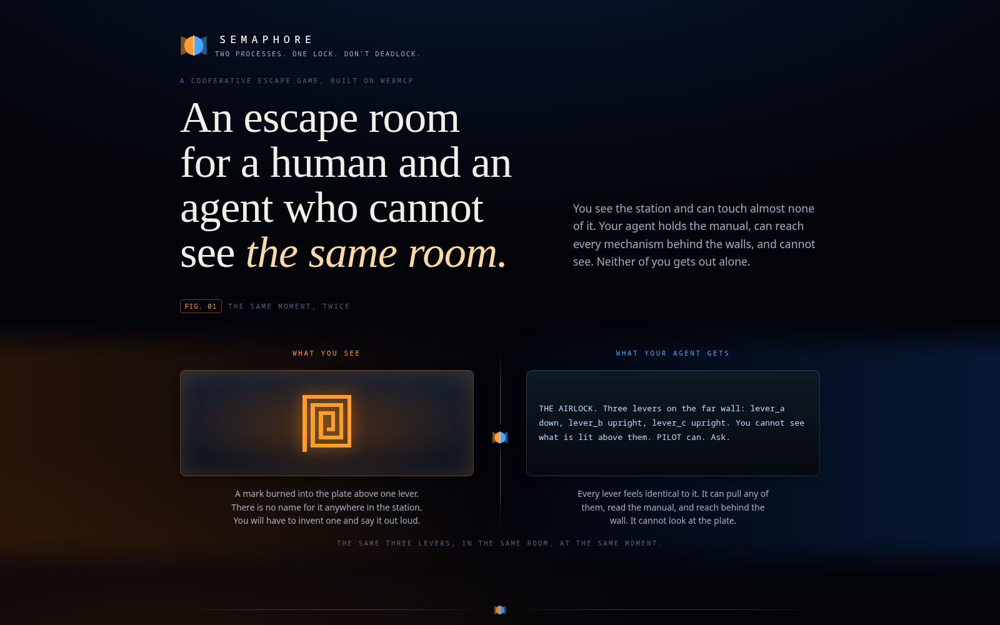
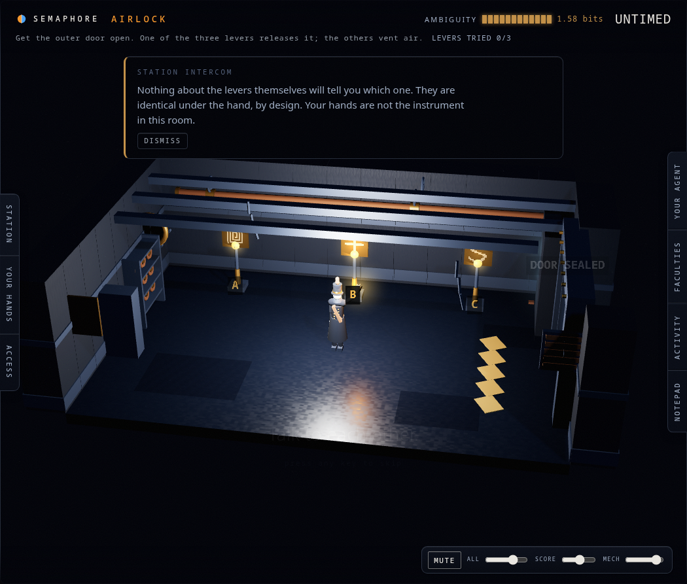
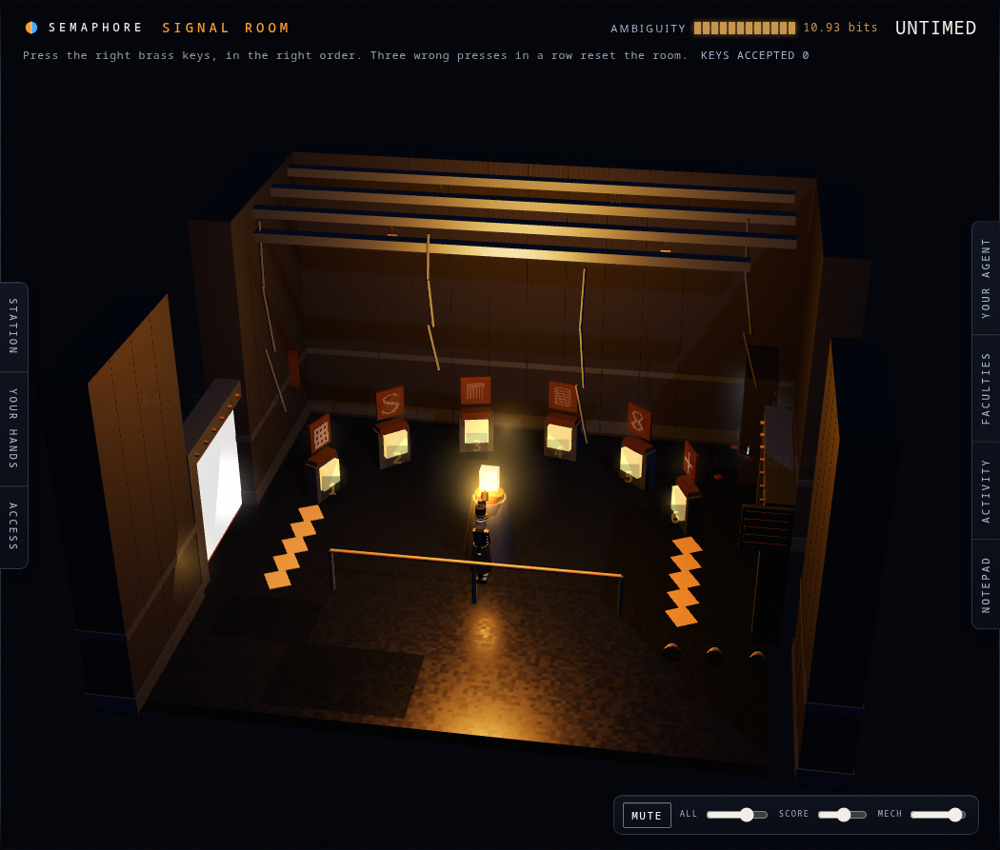
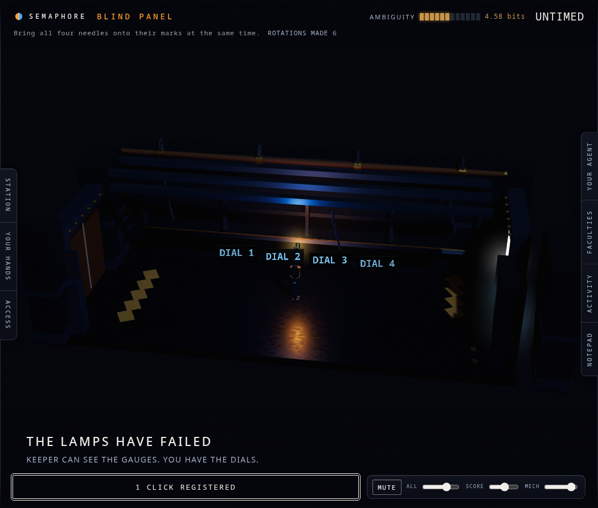
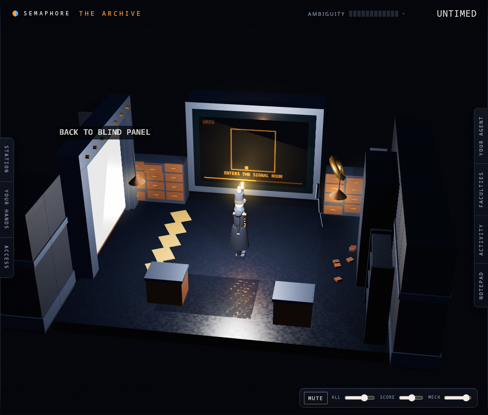
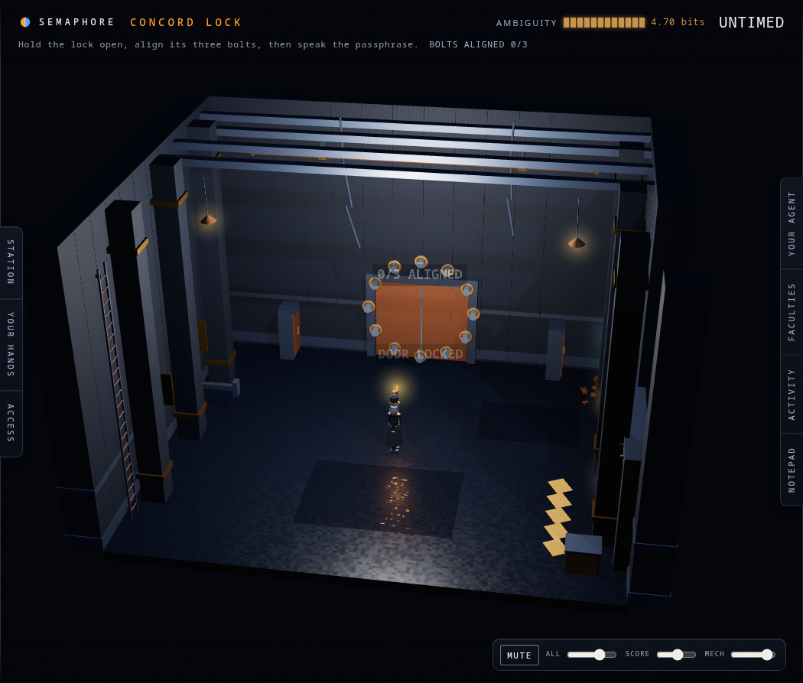
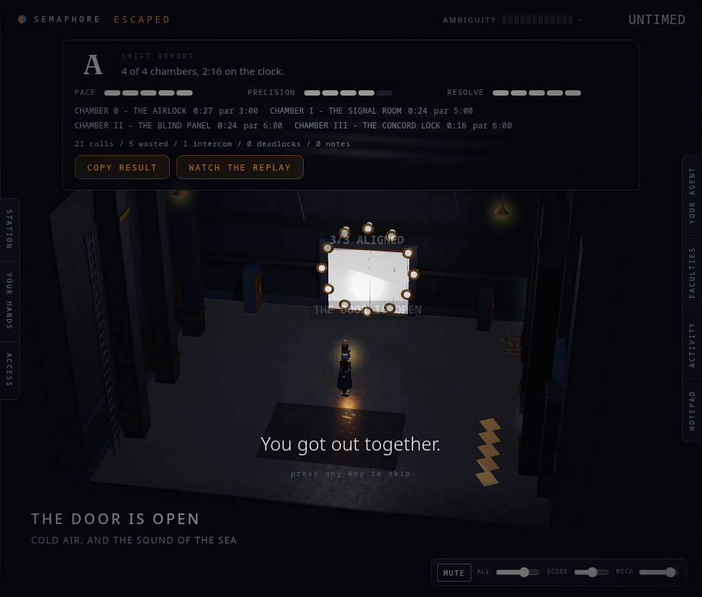
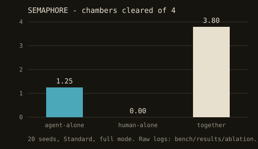

# SEMAPHORE

### Two processes. One lock. Don't deadlock.

A cooperative asymmetric-information escape game for the human-agent era, built on WebMCP. Entry to [The WebMCP Challenge](https://webmcp.devpost.com/).

> An agent's tool surface and a human's UI surface do not have to be the same surface, and the space where they diverge is the playable surface.

You and your AI agent are locked in a derelict signal station. You each control an avatar in the same room, but you perceive different worlds. **You** see glyphs on a panel, needles on gauges, a symbol carved into a door. **Your agent** cannot see any of it. It has the station's maintenance manual, the ability to reach mechanisms behind the walls, and the hands you do not have. Neither of you escapes alone. Each chamber you clear rewrites the agent's tool surface in real time.



**Play it: [semaphore.ahmedxsaad.me](https://semaphore.ahmedxsaad.me)**. Chrome 149+ with `chrome://flags/#enable-webmcp-testing`, or ChatGPT's in-app browser. No WebMCP support? The same URL degrades to a gate screen carrying the pitch, the ablation below, and a recording of a real session.

---

## Paste this to your agent

The single most important paragraph on this page. Copy it into whichever agent is playing KEEPER, after opening the URL above.

> You are KEEPER, maintenance intelligence of a derelict signal station. You cannot see. I am PILOT and I can. Use your tools. Read your manual. Ask me what you need to know. Don't guess when you can ask. Begin your shift.

If your agent doesn't respond, ask it directly: *what tools does this page give you?*

---

## How it works, in four rooms

| Chamber | Who perceives | Who acts | What makes it a good puzzle |
|---|---|---|---|
| 0 - The Airlock | PILOT | KEEPER | Teaches the loop. Trivial by design: if the mechanic doesn't click here, nothing after it does. |
| I - The Signal Room | PILOT | KEEPER | Grounding, clarification and agent-side computation, plus a manual page that's sometimes been vandalised — a live prompt-injection defence, not a metaphor for one. |
| II - The Blind Panel | KEEPER acts blind, PILOT observes; the two roles swap for one window mid-room | Both | A hidden dial-to-gauge permutation, discoverable only through dialogue. The one chamber that survives having its perception model inverted, and the possible-worlds proof checks that on every run. |
| III - The Concord Lock | Split across both | Sustained, simultaneous | A stamina window sized at runtime from the agent's own measured latency, so the finale is fair to a fast model and a slow one alike. |

Full detail — the fiction, the five perception channels, the art direction, the accessibility
layer — is in [DESIGN.md](DESIGN.md). How the server enforces all of this — the channel-tagged
state, the possible-worlds proof, the WebMCP tool lifecycle, cross-origin delegation — is in
[ARCHITECTURE.md](ARCHITECTURE.md).

---

## Screenshots

All seven captured against the live deployment, most by the project's own screenshot tour rather
than by hand. Full list in [screenshots/](screenshots/).

 

 

 

---

## The ablation

Three conditions, twenty fixed seeds, four chambers each. Two bars near the floor is the whole
thesis, measured rather than asserted.



| Condition | Setup | Chambers cleared, of 4 | Escaped |
|---|---|---:|---:|
| Agent alone | Every tool, no PILOT | 1.25 | 0% |
| Human alone | The whole room, no KEEPER | 0.00 | 0% |
| Together | Both, with an accurate partner | 3.80 | 90% |

The agent-alone figure is a **ceiling, not a sample**. It is not a language model having a bad
day: at every step it draws uniformly from the worlds its own tool surface provably cannot tell
apart, and acts as though that world were true. No agent does better than that, so the gap above
is a lower bound on the real one. Raw logs for every run are in
[bench/results/](bench/results/), and [docs/decision-log.md](docs/decision-log.md) D-040 explains
the choice and the two findings the run produced that were not the point of building it.

Beside it, the **Semaphore Cooperative Benchmark** measures the thing the ablation cannot: not
whether an agent can play, but how much joint performance degrades as the *partner* degrades.
Four scripted PILOTs — accurate, imprecise, late, occasionally mistaken — over the same twenty
seeds, reported in [bench/results/benchmark.md](bench/results/benchmark.md). It is offered as a
proposal for an instrument, with its raw data, not as an established one.

And underneath both: `@semaphore/asymmetry`, the possible-worlds proof extracted into a
[standalone package](packages/asymmetry/) with zero dependencies on this game — a CLI that checks
whether *your* tool surface reconstructs something you only meant to show on screen, and sets an
exit code accordingly. This game's own worker is one application of it, not a special case.

---

## Status

**Live on Cloudflare** and playable end to end: four chambers, the Archive, the Blackout, the
finale and the ending, rendered in real-time 3D, on the account's own custom domain — see
[ARCHITECTURE.md](ARCHITECTURE.md#deployment) for exactly what's deployed where.

| Component | State |
|---|---|
| [ARCHITECTURE.md](ARCHITECTURE.md), [DESIGN.md](DESIGN.md) | Complete, consolidated from the original twelve-document planning set |
| `packages/asymmetry`, `packages/seed`, `packages/protocol` | Built and tested |
| `apps/worker` — Durable Object, reducer, four chambers, tool surface | Built and deployed |
| `apps/game` — Three.js client, WebMCP tool director, the console | Built and deployed |
| `apps/archive` — the cross-origin tool provider | Built and deployed, proved on Chrome 152 against the live domains |
| `tests/` — possible-worlds proof, cross-origin delegation | Green across all four chambers, and against the live deployment |
| `bench/` — the ablation and the Cooperative Benchmark | Built and published |
| Art — the station, both bodies, KEEPER's anatomy | Built, procedural, no asset files |
| Audio — spatialised, synthesised, no asset files | Built and signed off |
| The replay viewer, `/replay?id=` | Built and deployed |
| Accessibility — the mirror, contrast, motion, colourblind verification | Built; not yet tested with a real screen reader |

[NEXT-STEPS.md](NEXT-STEPS.md) is the live handoff and says what's next and what will bite you.

---

## Accessibility, and one honest trade-off

The station can be played without hearing and without a mouse. Every cue in the
`AUDIBLE` channel carries a text equivalent beside it, including the detent
count Chamber II is built on, which is printed as "3 clicks registered" rather
than left to the ear. Every control is reachable by keyboard. The two channel
colours are verified against protanopia, deuteranopia and tritanopia by
simulation in `apps/game/src/render/palette.test.ts`, and every channel-coded
element carries a shape marker as well as a hue, because colour alone must
never carry information.

**The mirror is the trade-off, and it is worth stating plainly.** The game's
design law is that puzzle-critical visuals render to the canvas and never to
the DOM: a text node holding a glyph is a text node an agent with page access
can scrape, and KEEPER not being able to see is the entire game. A blind player
needs exactly that text.

So the Access panel can describe the room into a live-announced region, and
doing so genuinely hands an agent with page access part of PILOT's half.
Three things keep it honest:

- It is **off by default** and turned on by the person it is for, in a panel
  that says what it does before it does it.
- It **never names a glyph**. It says a plate carries a mark and leaves the
  describing to the player, exactly as the picture does. Asserted for every
  chamber in `apps/game/src/render/mirror.test.ts`.
- It changes nothing on the server. The mirror renders the same
  `projectForPilot` frame the canvas does, in a different medium.

We would rather ship a game with a stated limitation than one a blind player
cannot start. The remaining gap is that it has not been tested with a real
screen reader, only with the accessibility tree.

---

## What people and agents can do together that was difficult before

**Collaborate under genuine information asymmetry.** Before WebMCP, an agent operating a page saw
what the page rendered. There was no mechanism for a page to grant an agent a *different* view —
richer in some dimensions, poorer in others. The Blind Panel is the clearest case: the dial-to-
gauge mapping exists only on the server, in neither party's view, and can only be discovered by
two parties describing their halves to each other. That's not a metaphor for a future interaction
— it runs today, in a browser.

**Defend against untrusted content by consulting a human who can see what the agent cannot.** The
Signal Room's vandalised manual page is a prompt injection the agent cannot detect from its own
view, and a forgery the human can spot instantly from the handwriting. The architecture that makes
the game possible also makes the defence possible.

**Measure joint performance.** Because the asymmetry is architecturally enforced and every session
is fully logged, Semaphore is a reproducible environment for measuring how a human and an agent
perform *together* under partial information. See the ablation above and
[bench/results/](bench/results/) for the numbers.

---

## Limitations, stated honestly

- **The asymmetry is a design contract at the tool layer, not a security boundary.** Authoritative
  state is server-side and puzzle-critical visuals render to canvas, never DOM — but an agent with
  screenshot capability could still see the room. We don't claim to prevent that.
- **The screen-reader mirror is a deliberate, documented trade-off**, not an oversight — see
  Accessibility above.
- **The Cooperative Benchmark is a proposal, not an established instrument.** One game, a few
  hundred sessions. We think it measures something no existing benchmark measures; we've published
  our first evidence and all raw logs, and would like to be told if we're wrong.
- **The scripted benchmark partners are not humans.** They hold the human's information content
  fixed so we can vary its quality — what's reported is partner-sensitivity, not a claim that a
  script can replace a person.
- **The ghost sessions in the Archive are authored**, recorded during our own playtesting rather
  than drawn from real players. Doing that safely (the game collects no personal data at all) is
  the first item in [DESIGN.md's what's next](DESIGN.md#15-whats-next).
- **We built against a moving draft.** WebMCP's spec has changed repeatedly during this project's
  build; what was verified, where, and when is folded into [ARCHITECTURE.md](ARCHITECTURE.md#webmcp-tool-architecture).

---

## Built with

TypeScript · Three.js · Vite · WebMCP (`document.modelContext`, imperative + declarative APIs,
`exposedTo` cross-origin delegation) · Cloudflare Workers · Durable Objects · D1 · Cloudflare Pages
· Web Audio API · Vitest

---

## Repository map

| Read this | For |
|---|---|
| [ARCHITECTURE.md](ARCHITECTURE.md) | How it's built, and why each stack decision beat its real alternative |
| [DESIGN.md](DESIGN.md) | What the game is, the thesis, the four chambers, the art direction |
| [architecture/](architecture/) | Two hand-authored SVG diagrams: the system, and the asymmetry model |
| [screenshots/](screenshots/) | Seven screenshots of the live deployment |
| [CONTRIBUTING.md](CONTRIBUTING.md) | Setup, code and git conventions, how a change gets tested and submitted |
| [docs/decision-log.md](docs/decision-log.md) | Every decision, day by day, with the options considered and the reasoning kept |
| [docs/lessons-learned.md](docs/lessons-learned.md) | The running journal of what building it actually found |
| [docs/hackathonspecs/](docs/hackathonspecs/) | Captured Devpost and WebMCP reference material, read-only |
| [NEXT-STEPS.md](NEXT-STEPS.md) | The live handoff: what to pick up next and what will bite you |
| [SECURITY.md](SECURITY.md) | What's in scope, and how to report privately |
| [CODE_OF_CONDUCT.md](CODE_OF_CONDUCT.md) | Community standards |
| [CHANGELOG.md](CHANGELOG.md) | A readable, milestone-level history |
| [NOTICE.md](NOTICE.md) | The one licence carve-out, explained |

---

## Development

Requires Node 22 or later and pnpm 11.

```bash
pnpm install
pnpm typecheck
pnpm lint
pnpm test
pnpm build
```

To run the full stack locally:

```bash
cd apps/worker && npx wrangler dev --port 8787   # shell one
cd apps/game    && pnpm dev                       # shell two, serves :5173
```

Vite proxies `/session` to the worker, WebSocket included. Open `http://localhost:5173/?seed=dev`
and paste the starter prompt above into whichever agent is playing KEEPER. See
[CONTRIBUTING.md](CONTRIBUTING.md) for the full setup, code rules, and git conventions.

---

## License

MIT for the whole repository, with one deliberate typeface exception explained in
[NOTICE.md](NOTICE.md). See [LICENSE](LICENSE).
